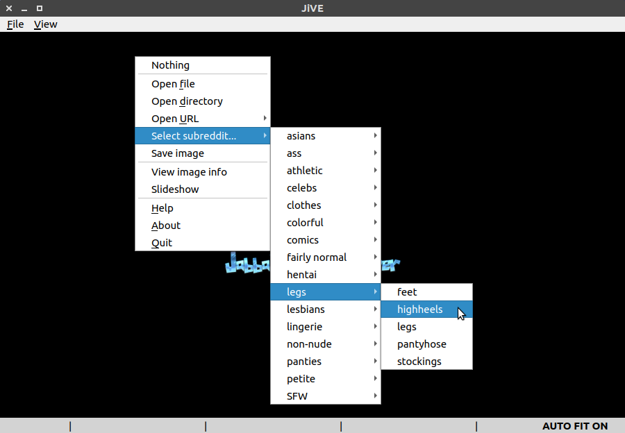

JiVE (Jabba's Image Viewer)
===========================

A cross-platform image viewer with some built-in NSFW support, written in Python 3 using PyQt5.

This is a work in progress... but it's already usable.

Screenshots
-----------

In action:

  

Selecting an NSFW subreddit:

  

The subreddits are read from a config file (`categories/categories.yaml`), so feel free to edit and extend
this file with your favourite subreddits...

Table of Contents
-----------------

* [Motivation](docs/motivation.md)
* [Installation](docs/installation.md)
* [Launching the application](docs/launching.md)
* [First steps after installation (API keys)](docs/first_steps.md)
* [NSFW support](docs/nsfw.md)
