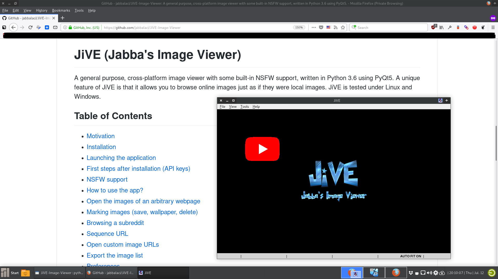

JiVE (Jabba's Image Viewer)
===========================

A general purpose, cross-platform image viewer with some built-in NSFW support, written in Python 3.6 using PyQt5.
A unique feature of JiVE is that it allows you to browse online images just as if they were local images. JiVE
is tested under Linux and Windows.

Table of Contents
-----------------

* [Motivation](docs/motivation.md)
* [Installation](docs/installation.md)
* [Launching the application](docs/launching.md)
* [First steps after installation (API keys)](docs/first_steps.md)
* [NSFW support](docs/nsfw.md)
* [How to use the app?](docs/usage.md)
* [Open the images of an arbitrary webpage](docs/webpage.md)
* [Marking images (save, wallpaper, delete)](docs/marking.md)
* [Browsing a subreddit](docs/browsing_subreddit.md)
* [Sequence URL](docs/sequence_url.md)
* [Open custom image URLs](docs/open_custom_urls.md)
* [Export the image list](docs/export.md)
* [Preferences](docs/preferences.md)
* [Command-line arguments](docs/command_line.md)
* Tools
  + [Find duplicates](docs/duplicates.md)
* Development
  + [[dev] Build automation](docs/build.md)
  + [[dev] Local settings](docs/settings.md)
  + [[dev] caching](docs/cache.md)
* [Logging](docs/logging.md)
* [FAQ](docs/faq.md)

Demo
----

Click on the image below to open a YouTube video that shows the basic
functions of JiVE:

  

Screenshots
-----------

In action:

  

Selecting an NSFW subreddit:

  

The subreddits are read from a config file (`categories/categories.yaml`), so feel free to edit and extend
this file with your favorite subreddits...
