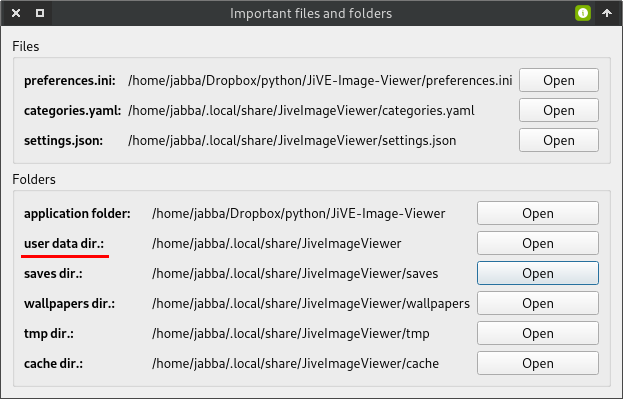

Frequently Asked Questions
==========================

Where is the user data dir.?
----------------------------
Go to *View* -> *Important files and folders*, and there check out the value of
"user data dir."

  

The app. quits with the warning "QCoreApplication::postEvent: Unexpected null receiver"
---------------------------------------------------------------------------------------
It only happens if the audio sound is enabled. It must be a Qt issue. This is a harmless
warning, so it can be ignored.
