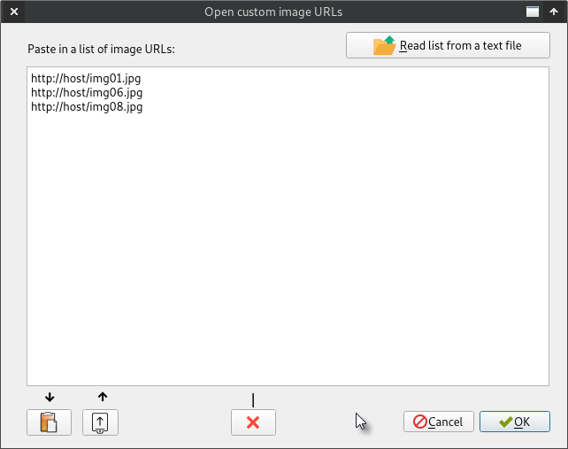

Open custom image URLs
======================

Under *File* -> *Open list of image URLs*, you can find the following GUI:

  

Just paste in the text area a list of image URLs and press OK to open them.

You can also read the list of image URLs from a text file. For this,
press the button in the top right corner.
