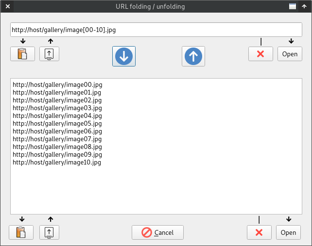

Sequence URL
============

When you open a gallery, very often the URLs of the images follow a simple pattern:

* http://www.example.com/gallery/01.jpg
* http://www.example.com/gallery/02.jpg
* ...
* http://www.example.com/gallery/20.jpg

These URLs can be represented in a compressed form: http://www.host.com/gallery/[01-20].jpg

For JiVE you can specify such a URL (called sequence URL). JiVE will restore the
URLs and open them.

Example (Warning! NSFW content!)
--------------------------------

Here is a concrete NSFW example: https://content9.erosberry.com/digitaldesire.com/6003/[00-03].jpg

Press *Ctrl+U* (auto-detect URL) and paste the example above.

GUI
---

Under *Tools* -> *URL folding / unfolding* you can find a GUI for manipulating
sequence URLs:

  

At the top, you can insert a sequence URL. With *Open* you can open
its images. If you press the blue Down arrow, the sequence URL will be unpacked.

You can also insert a list of image URLs in the text area and then press
the blue Up arrow. The list will be compressed into a sequence URL.
Pressing the Open button will open the image links in the text area.
