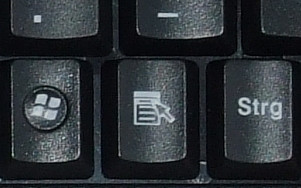
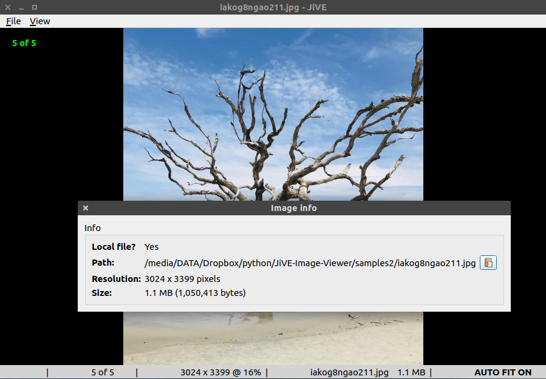

How to use the app?
===================

After launching the app, you get a blank window with a logo.
The app has three main parts:
* menu bar (at the top)
* image area (in the center) with a popup menu (right click)
* status bar (at the bottom)

The software is still under progress, thus the menu bar and the
popup menu will change in the future.

Now let's see the functionalities of the app.

Quit (*q*, *Ctrl+Q*)
--------------------

With *q* you can quit the application quickly. *Ctrl+Q* is another
shortcut for quitting. *Alt+F4* and closing the window also work :)

Open file (*Ctrl+O*)
--------------------

Open a local file.

It's also available in the menu bar and in the popup menu.
(From now on, if a functionality is present in a menu, I won't mention it.)

When you open a file, JiVE will also collect all the images in the
same directory (non-recursively). Thus, with the arrow keys, you'll
be able to browse among them.

Open directory (*Ctrl+D*)
-------------------------

Open a local directory.

JiVE collects all the images in the selected directory (non-recursively)
and opens the first image.

Navigating among the images
---------------------------

*Left arrow* / *Right arrow* -- jump to the previous / next image

The status bar is divided into several parts. The left one is used to
show information / error messages. If there is no previous / next image,
you get a warning message there. If an image cannot be displayed due to
some error, you get a big red cross.

*Home* / *End* -- jump to the first / last image

*PageDown* / *PageUp* -- jump 5% forward / backward in the image list

It's useful if you have a lot of images in the list and you want to move
forward / backward faster.

You can also use your mouse. If you left click on the left 25% of the image (by width),
you'll jump to the previous one. If you click on the right 25% of the image (by width),
you'll jump to the next one. The center 50% of the window is a neutral area.

Audio feedback
--------------

If there's a warning / error, you'll hear a short audio sound. You can switch
it off in the `preferences.ini` file. Personally, I find it useful since
error messages in the bottom left corner are sometimes hard to notice.

For adjusting the volume of the sound effect, I suggest the following
method: open JiVE and press the left arrow. Since there's no previous image,
you'll hear the error sound. Adjust the volume to your liking.

Auto Fit mode (*Ctrl+F*)
------------------------

The app starts in this mode, this is the default. It means images are resized
to fit the window. If you resize the window, you'll notice that the current image
is automatically resized to fit the window.

In the status bar you can see the resolution of the image and the zoom level.

With *Ctrl+F* you can switch the Auto Fit mode on / off. In the status bar, on
the right side, you'll see if it's on or off.

Auto Width mode (*Ctrl+W*)
--------------------------

Another mode. The image is resized to fill 80% of the width of the window.
To change this width, edit the value of `IMG_WIDTH_TO_WINDOW_WIDTH_IN_PERCENT`
in `config.py`.

If you resize the window, the image is also resized, but on the left and right
sides there will always be 10%-10% margins.

This mode was made for reading comics, where the height of an image is usually
much more than its width.

With *Ctrl+W* you can switch the Auto Width mode on / off. In the status bar, on
the right side, you'll see if it's on or off.

Maximize / Un-maximize the window (*m*)
---------------------------------------

With *m* you can maximize / un-maximize the window.

Full screen (*F11*)
-------------------

With *F11* you can toggle between full screen and normal mode.
In full screen mode the menu bar and the status bar are hidden.

If you hit *Esc* in full screen mode, you can go back to normal mode.

(Note: I prefer the maximized mode.)

Hide the mouse cursor (*Ctrl+M*)
--------------------------------

With *Ctrl+M* you can hide / show the mouse pointer.

Hide the menu bar (*Alt+M*)
---------------------------

With *Alt+M* you can hide / show the menu bar. If you switch to
full screen, the menu bar will be hidden. If you switch from full
screen to normal screen, the menu bar will be shown.

Zoom (*+*, *-*, *=*)
--------------------

Zoom doesn't work if one of the auto modes (Auto Fit or Auto Width) is on.

With *+* you can zoom in. With *-* you can zoom out. With *=* you can set zoom back to 100%.

Tip: you can press *Ctrl+F* any time to switch to auto fit.

Scrolling
---------

If you zoom in an image, scrollbars will appear.

You can use the mouse wheels to scroll up / down.

*Shift+Up* / *Shift+Down* -- scroll up / down

*Shift+Left* / *Shift+Right* -- scroll left / right

If NumLock is on, you can also use 4, 6, 8, 2 to scroll left, right, up and down (respectively).

Show image path (*p*)
---------------------

With *p* (without Shift) you can show / hide the path of the image.

Copy image path to clipboard (*Shift+P*)
----------------------------------------

With *Shift+P* you can copy the image's absolute path / URL to the clipboard.

Random jump (*r*)
-----------------

With *r* (without Shift) you can jump to a random position.

When random jumping, go back to the previous image (*Shift+R*)
--------------------------------------------------------------

When you keep pressing *r*, it can happen that you go over a nice image
and your brain detects too late how awesome that image was. Don't worry!
With *Shift+R* you can jump back to the previous image in the random order.

Open the images of a subreddit / imgur album / tumblr post / etc. (*Ctrl+U*)
----------------------------------------------------------------------------

*Right click* -> *Open URL...* -> *Auto detect URL* **or** *Ctrl+U*

It can detect different URLs and extract images from them.

Some examples. Open the *Auto detect URL* dialog and paste these:

* https://i.imgur.com/k489QN8.jpg (direct link to an image)
* https://imgur.com/gallery/9p0gCyv (imgur gallery)
* https://imgur.com/a/uAFvn (imgur album)
* https://different-landscapes.tumblr.com/post/174158537319 (tumblr post)

And now the subreddits (further examples):

* https://www.reddit.com/r/EarthPorn/
* /r/EarthPorn
* earthporn

If you provide just a word, e.g. *turtles*, JiVE will try to locate the
subreddit [/r/turtles](https://www.reddit.com/r/turtles) and if it exists,
all its images are extracted and shown. Of course, you can provide any subreddit
here, even if it's not in the menu categories. Note that the format "r/something"
is not supported; use "/r/something" instead or just simply write "something".

As a subreddit is processed, a progress bar is shown in the status bar.

Sequence URL is also supported:

* https://content9.erosberry.com/digitaldesire.com/6003/[00-03].jpg (Warning! NSFW content!)

The sequence in square brackets will be expanded. This compressed representation
of galleries is borrowed from fuskator.com (Warning! NSFW site!).

Open the images of an arbitrary webpage (*Ctrl+Shift+U*)
--------------------------------------------------------

You can also find it under the *Tools* menu. With this you can extract images
from an arbitrary webpage. Here we use simple web scraping. It'll be presented
in detail in a dedicated section.

Drag & drop
-----------

You can open a file or folder with drag & drop too.

Context (popup) menu
--------------------

The context (popup) menu can be activated with a right mouse click.
On most keyboards there is a dedicated button for popup menus. You
can also bring up the context menu with this button.

  

Reset (*Ctrl+Alt+R*)
--------------------

With the reset you can go back to the initial state of the app. It can be
necessary if you modified the `categories.yaml` file and you want to re-read it
without restarting the app.

Image info (*i*)
----------------

With *i* you can get some information about the current image.

  

The image info window is modal, i.e. you need to close it first if you want to
interact with the main window. The image info can be closed with *i*, *q*, and *Esc*.

Tip: If you want to look at the image info and then you want to close it quickly,
just press *i* twice.

Next to the path there is a clipboard button. Press it to copy the path
to the clipboard.

Shuffle images (*Tools* -> *Shuffle images*)
-------------------------------------------

Shuffle (randomize) the order of images. It sets you back to the first image.

Save current image as... (under *File* or *Ctrl+S*)
---------------------------------------------------

You can save the current image with *Ctrl+S*. You need to specify the
destination folder and file name.

Reload the current image (*F5*)
-------------------------------

With *F5* you can reload the current image. It's useful if you modify
the current image with another program (for instance you opened the
current image with Gimp). To see the changes, just press *F5*.

