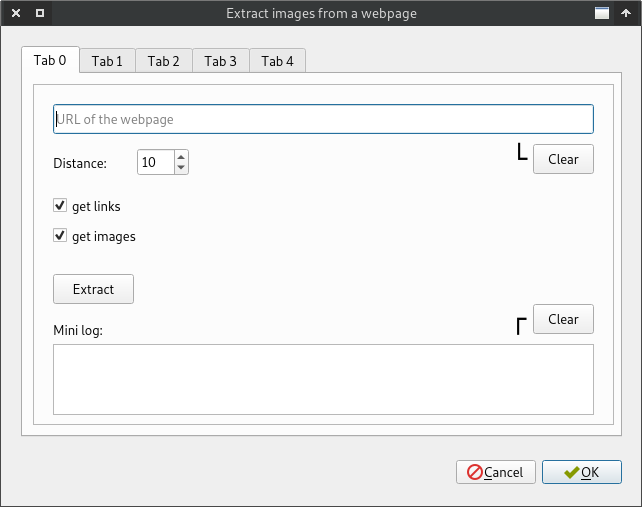

Open the images of an arbitrary webpage
=======================================

When you use "Auto detect URL" (*Ctrl+U*), JiVE
will use specialized extraction methods. For instance,
if you open an Imgur album, JiVE will fetch the album images
using Imgur's own API.

If a webpage is not detected automatically, then use a general
method that you can find under *Tools* -> *Extract images from a webpage*.
It also has a shortcut: *Ctrl+Shift+U*. You'll get the following window:

  

How to use it? (short version)
------------------------------

Paste in the URL of the webpage and click on the Extract button. JiVE will
find the images and present them in Tab1 -- Tab4 using different grouping
techniques. Select the tab that contains the most relevant images and click on
OK.

How to use it? (longer version)
-------------------------------

If "get links" is selected, JiVE will extract links that point to images.
If "get images" is selected, JiVE will extract images that are embedded in the
webpage. If you don't select any of them, no images will be found.

Duplicates are removed.

Tab 1 presents the elements in the order they were found in the webpage. This
is a raw, unprocessed list of elements.

In Tab 2 and Tab 4 we do clustering. I have a blog post about it, you can
read it [here](https://pythonadventures.wordpress.com/2013/11/08/extracting-relevant-images-from-xxx-galleries-using-text-clustering/).
The idea is that relevant images usually follow a pattern, e.g. only their
ends differ: .../01.jpg, .../02.jpg, etc. With clustering we try to find
the relevant images and we try to discard the others. With the distance value
on Tab 0 you can fine tune the clustering method. If the distance is low,
clustering is stricter. If this value is higher, you'll find larger clusters,
but they may include more noise. Distance is a parameter that you can play
with.

Tabs 1 to 4 present different results. There's no best method, that's why present four
different results. It can happen that on webpage A you have the best result in Tab 1 while
on webpage B you get the best result in Tab 3 for instance. Check all the tabs
and select the one that contains the most relevant images. With the eye-balling
technique it must be easy :)

On Tabs 1 to 4, the text areas are editable. Thus, if there are some irrelevant
images in the list, you can delete them. When the list looks good, hit OK.

The tab names include the number of images. These counters are updated when you switch
between tabs. Empty lines and comments are ignored. The counter reflects the number
of image URLs only.

Keyboard navigation
-------------------

The window can be used without mouse too. Paste the URL (*Ctrl+V*) and Press Enter to
extract the images. If you click on OK (*Alt+O*), the content of Tab 1 will be used.

When the images are extracted, you can browse between the tabs with *Alt+Left*, *Alt+Right* or
*Ctrl+PgUp*, *Ctrl+PgDown*. If you click on OK (or press *Alt+O*) on Tab 1 -- Tab 4, the content of the current tab will be used.
